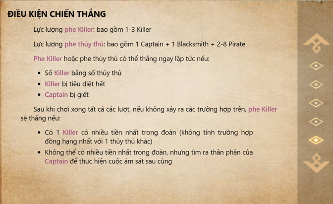

<br />
<div align="center">
  <a>
    
  </a>
  <p align="center">
    <a href="https://github.com/NDTungHCMUS">Nguyen Dinh Tung</a>
    </br>
    <a href="https://github.com/ginganotnigg">Pham Cong Bang</a>
    </br>
    <a href="https://github.com/tuongkhtn">Huynh Thanh Tuong</a>
    </br>
    <a href="https://github.com/thainhatminh2005">Thai Nhat Minh</a>
    </br>
  </p>
</div>

## About the project
- Treasure Conquer is an interactive multiplayer game. This game is inspired by the traditional Werewolf game. This is a strategy, hidden identity game, which is built on the web platform. Players will take turns making their decisions within a set timeframe. Apply the wisest strategies to achieve victory!

## Gameplay
- In the game, each player will be assigned one of four roles (pirate, captain, blacksmith, killer). The Killer is the adversary to the other roles. Each player will win alongside their faction. The Killer's mission is to eliminate the Captain (the leader of the pirate crew). Conversely, the Killer is the target that the pirate crew needs to eliminate. 
- The game will consist of 4-7 rounds, each round comprising two phases: Hunting and Gathering. In the Hunting phase, players will choose treasures on the island's map. When a player selects a chest, they'll be moved to the cave containing the chosen treasure. In the Gathering phase, players must uncover the Killer's identity to throw them off the ship. These two phases will alternate until the the end of the game or the winning team appears.

## Setup 
1. Install NodeJS (`https://nodejs.org/en`)
2. Run this command in your terminal: 
```
npm install -g yarn
```
3. Then change direction to your project's directory.
4. Create new project with **package.json** file:
```
yarn init -y
```
5. Build ExpressJS and Socket.io libraries:
```
yarn add express socket.io
```
6. (Optional) Build **Nodemon** to manage code and debug more easily
```
yarn add --dev nodemon
```

## Usage
### Initial Screen
<div align="center">
    
</div>

- Players can create new rooms or join existing rooms.

### Instruction and Context
<div align="center" style = "margin-bottom: 20px">
    
    
</div>
<div align="center" style = "margin-bottom: 20px">
    
    
</div>
<div align="center">
    
    
</div>

- Players should read all the information here to understand the game's rules clearly.
- They can get access to these rules everytime during this game.

### RestRoom Screen
<div align="center">
    
    
</div>

- Players can see all opponents in this game. They can also change the color for their characters. They can still leave room in this duration.
- Admin can customize some properties(number of killers, number of turns, vote duration, treasure choosing duration) for this game.
- Admin press start button to begin new game.

### GamePlay Screen
<div align="center">
    
    
    
</div>

- Each player is assigned a role (BlackSmith, Killer, Pirate, Captain).
- Each player can choose a treasure chest to jump in each day.
- In the cave, each player will see the number of players who have chosen the same cave as them.
- After treasure choosing duration, the screen will be changed to vote screen.

### Vote Screen
<div align="center">
    
    
    
</div>

- Each player can vote for at most one other player they want to eliminate from the game.
- The player with the most votes will be eliminated from the game.
- All players can chat together to choose the one who they want to vote.

### Victory and Defeat State
<div align="center">
    
    
</div>

## Technologies used
- HTML/CSS/JS for Game UI. 
- Socket.io(an open-source Javascript library).
- Jquery (an open-source Javascript library).
- NodeJS and ExpressJS (a framework of NodeJS).